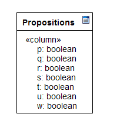

# Operadores booleanos en PostgreSQL

La lógica proposicional o calculo proposicional es una herramienta utilizada en muchas áreas del conocimiento: en matemáticas se utiliza para demostrar teoremas, en derecho se utiliza para la formulación de argumentos, en física para establecer el procedimiento para llevar a cabo un experimento, en el campo de la computación  tiene un papel relevante ya que se relaciona con las áreas de Inteligencia Artificial y Lenguajes de programación.

En cuanto a esta última área, su utilización va desde la demostración de programas hasta la creación de un paradigma de desarrollo llamado programación lógica relacional cuyo  exponente principal es el lenguaje de programación <strong>Prolog</strong>.

  <h2>Proposiciones</h2>
  
La proposición simple es la unidad básica de construcción de la lógica proposicional.

  
Una proposición simple es un enunciado declarativo al cual se le puede asignar uno u otro (nunca ambos) de dos valores:<strong>falso</strong>  representado por la letra (f) o el dígito (0) y <strong>verdadero</strong> representado por la letra  (v) o el dígito (1), estos valores son llamados valores de verdad (truth values).

  
Algunos ejemplos de proposiciones en un lenguaje natural con su correspondiente valor de verdad.

  <pre>
<i>Japón es un país de Europa (Falso)</i> 
<i>Alemania es un país de Europa (Verdadero)</i> 
<i>Charles Darwin escribió el origen de las especies en 1905 (Falso)</i> 
<i>Charles Darwin escribió el origen de las especies en 1859 (Verdadero)</i>
  </pre>
  
Para la representación de operaciones lógicas <strong>PostgreSQL</strong> cuenta con el tipo de dato <strong>boolean</strong> que guarda la representación de cualquiera de los valores de verdad mas el valor NULL. Este tipo de dato cuenta con sinónimos para la representación de valores <strong>true</strong> y <strong>false</strong> , sin embargo en el campo de tabla solo se almacenaran los valores <strong>t</strong>  para <strong>true</strong>  y <strong>f</strong>  para <strong>false</strong>. A continuación la tabla de sinónimos para estos valores:

  <table>
  <tr>
  <td><strong>Valor de campo</strong></td>
  <td><strong>Sinónimo</strong></td>
  </tr>
  <tr>
  <td>T</td>
  <td>True,  t,  yes,  y, 1</td>
  </tr>
  <tr>
  <td>F</td>
  <td>False, f, no, n, 0</td>
  </tr>
  </table>
  
Mostraré unos ejemplos de operaciones booleanas básicas, creamos la siguiente tabla:

 
  
Ahora insertaré unos registros, como proposiciones utilizaré las columnas nombrándolas con las letras standard que se usan para representarlas, en otra columna almacenaré su correspondiente valor de verdad, esto lo hago con el siguiente script.

 
   
Al ejecutar el script y después la consulta <i>SELECT * FROM propositions</i> observamos que a pesar de los sinónimos en los comandos <strong>INSERT</strong>, únicamente se almacenaron en la tabla los valores <strong>f</strong>  y <strong>t</strong>.

 

Adicionalmente al tipo de dato <strong>boolean</strong> ,<strong>PostgreSQL</strong> cuenta con los operadores lógicos o conectores <strong>AND</strong> , <strong>OR</strong>  y <strong>NOT</strong>  que permiten formar proposiciones compuestas, es decir proposiciones que se forman por dos o más proposiciones simples unidas por conectores.

  

<strong>Conjunción AND</strong>
  
Multiplicación lógica, su tabla de verdad incluyendo el valor NULL es la siguiente:

  <table width="50%">
      <tr>
          <td><strong>P</strong></td>
          <td><strong>Q</strong></td>
          <td><strong>P AND Q</strong></td>
      </tr>
      <tr>
          <td>True</td>
          <td>True</td>
          <td>True</td>
      </tr>
      <tr>
          <td>True</td>
          <td>False</td>
          <td>False</td>
      </tr>
      <tr>
          <td>False</td>
          <td>True</td>
          <td>False</td>
      </tr>
      <tr>
          <td>False</td>
          <td>False</td>
          <td>False</td>
      </tr>
      <tr>
          <td>Null</td>
          <td>True</td>
          <td>Null</td>
      </tr>
      <tr>
          <td>Null</td>
          <td>False</td>
          <td>False</td>
      </tr>
      <tr>
          <td>Null</td>
          <td>Null</td>
          <td>Null</td>
      </tr>
  </table>
  
Ejecuto unas consultas con el operador <strong>AND</strong> en <strong>PostgreSQL</strong> , para confirmar la tabla de verdad (truth table):

 

 
 

  
 

 
 
 
    
<strong>Disyunción OR</strong> 

    
Suma lógica, su tabla de verdad incluyendo el valor NULL es la siguiente:

    <table>
        <tr>
            <td><strong>P</strong></td>
            <td><strong>Q</strong></td>
            <td><strong>P OR Q</strong></td>
        </tr>
        <tr>
            <td>True</td>
            <td>True</td>
            <td>True</td>
        </tr>
        <tr>
            <td>True</td>
            <td>False</td>
            <td>True</td>
        </tr>
        <tr>
            <td>False</td>
            <td>True</td>
            <td>True</td>
        </tr>
        <tr>
            <td>False</td>
            <td>False</td>
            <td>False</td>
        </tr>
        <tr>
            <td>Null</td>
            <td>True</td>
            <td>True</td>
        </tr>
        <tr>
            <td>Null</td>
            <td>False</td>
            <td>Null</td>
        </tr>
        <tr>
            <td>Null</td>
            <td>Null</td>
            <td>Null</td>
        </tr>
    </table>
    
Ejecuto unas consultas con el operador <strong>OR</strong> en <strong>PostgreSQL</strong> , para confirmar la tabla de verdad (truth table):

    

    
    
 
    

    
    
 
    
<h2>Negación NOT</h2>

    
Este operador invierte el valor de la proposición, su tabla de verdad incluyendo el valor NULL es la siguiente:

    <table>
        <tr>
            <td><strong>S</strong></td>
            <td><strong>NOT S</strong></td>
        </tr>
        <tr>
            <td>True</td>
            <td>False</td>
        </tr>
        <tr>
            <td>False</td>
            <td>True</td>
        </tr>
        <tr>
            <td>Null</td>
            <td>Null</td>           
        </tr>
    </table>
    
Ejecutando el operador <strong>NOT</strong> en <strong>PostgreSQL</strong>, en las siguientes consultas, para confirmar la tabla de verdad (truth table):

    

    
 
    

    
 

Con este repaso vemos que en el contexto de las bases de datos además de los valores de verdad como <strong>True</strong> y <strong>False</strong> tenemos que considerar el valor <strong>NULL</strong> al momento de hacer operaciones booleanas.

